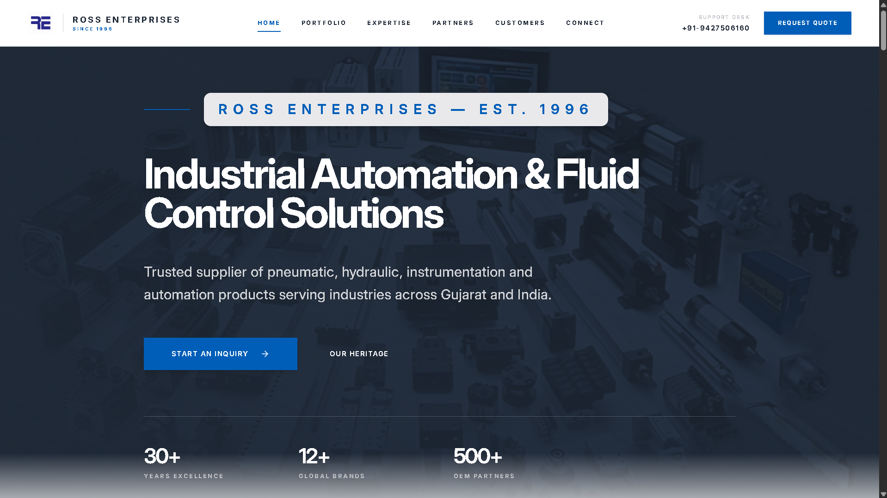
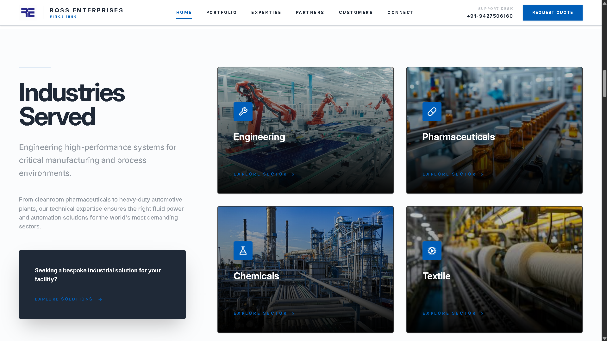
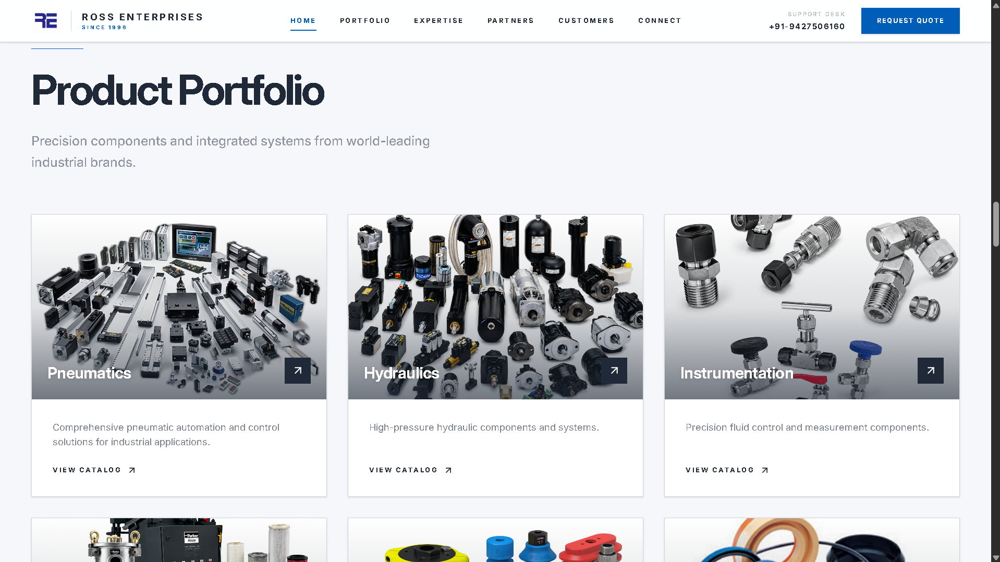
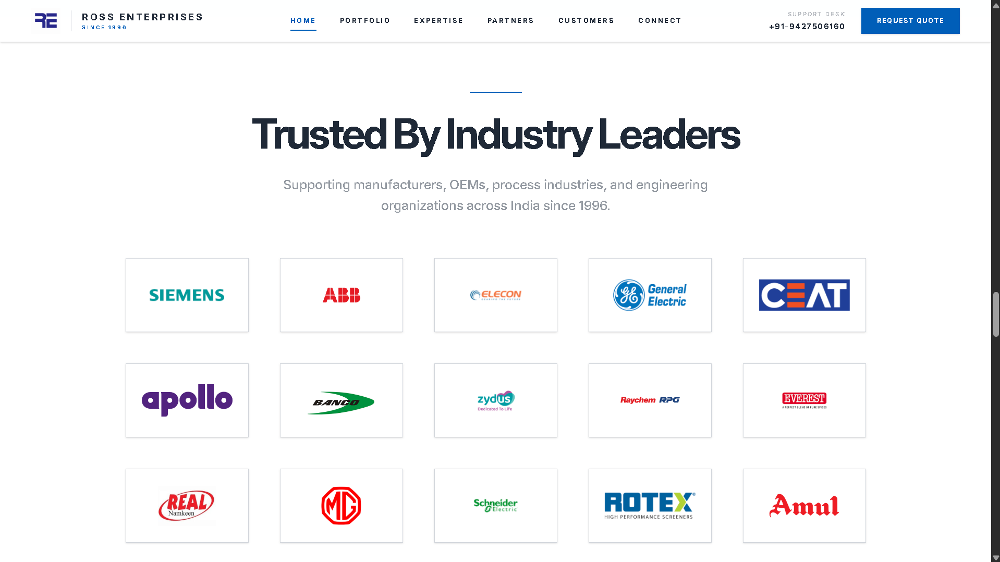
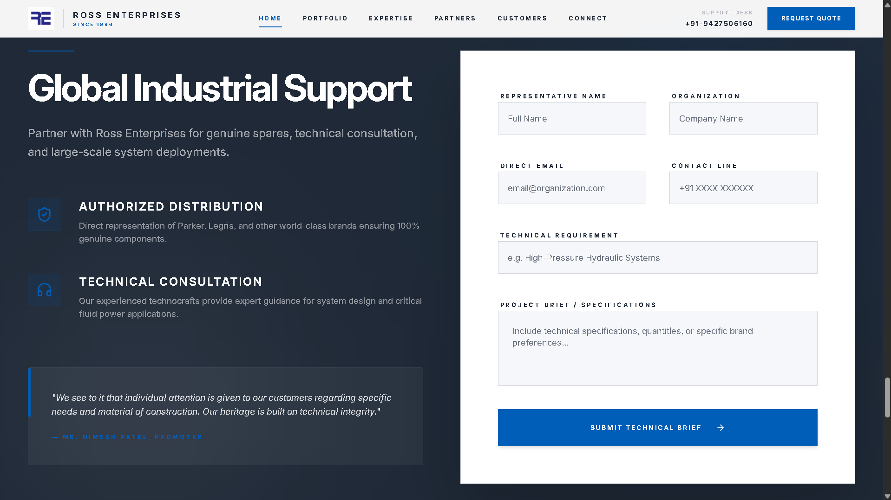

<div align="center">

# Ross Enterprises Corporate Website

### Industrial Automation & Fluid Control Solutions (Est. 1996)

[](https://nextjs.org/)
[](https://www.typescriptlang.org/)
[](https://tailwindcss.com/)
[](https://www.framer.com/motion/)
[](https://www.cloudflare.com/products/turnstile/)

</div>

---

# 🌐 Live Website

**Production Website**

https://rossenterprises.in

**GitHub Repository**

https://github.com/Jaayyy21/ross-enterprises-website

---

# 📸 Website Preview

## Homepage



---

## Industries We Serve



---

## Product Portfolio



---

## Customers



---

## Technical Inquiry Form



---

# 📖 Overview

Ross Enterprises is an established industrial automation company headquartered in Vadodara, Gujarat, serving customers across India since **1996**.

This project modernizes the company's online presence with a fast, secure, responsive website built using modern web technologies. Beyond acting as a corporate website, it functions as a digital sales platform, trust builder, and secure technical inquiry portal.

The project was built with a strong focus on:

- Enterprise-grade UI/UX
- Performance
- Security
- Accessibility
- Responsive design
- SEO
- Production deployment

---

# 🏢 Business Objectives

The website was designed to help Ross Enterprises:

- Showcase decades of engineering expertise
- Present an extensive industrial product portfolio
- Display partnerships with globally recognized manufacturers
- Build trust through customer showcases
- Generate qualified technical inquiries
- Deliver a premium experience across all devices

---

# 🚀 Highlights

- Production website for a real industrial automation company
- Fully responsive across desktop, tablet, and mobile
- Modern enterprise UI with smooth animations
- Secure inquiry form protected by Cloudflare Turnstile
- Server-side email delivery using Resend
- Built with Next.js App Router and TypeScript
- Deployed on Vercel with a custom production domain

---

# ⚡ Technology Stack

## Frontend

- Next.js 16 (App Router)
- React
- TypeScript
- Tailwind CSS
- Framer Motion
- Lucide React

## Backend

- Next.js Server Actions
- Resend Email API

## Security

- Cloudflare Invisible Turnstile
- Zod Validation
- Honeypot Protection
- Security Headers

## Deployment

- Vercel
- Custom Domain
- HTTPS

---

# ✨ Features

- Responsive enterprise website
- Animated landing page
- Product portfolio
- Industry showcase
- Customer showcase
- Partner showcase
- Secure technical inquiry form
- Production-ready deployment
- SEO optimized
- Accessibility focused
- Image optimization
- Dynamic metadata
- Sitemap generation
- Robots configuration

---

# 🔒 Security

The inquiry system follows a defense-in-depth approach.

Implemented protections include:

- Cloudflare Invisible Turnstile
- Server-side Turnstile verification
- Zod schema validation
- Honeypot spam detection
- Secure Server Actions
- Environment variable protection
- Secure email delivery with Resend
- Graceful error handling

---

# ⚙️ Engineering Challenges

Some of the most significant engineering work included:

- Migrating to Next.js App Router
- Production deployment on Vercel
- DNS migration to custom domain
- Cloudflare Turnstile integration
- Secure server-side form handling
- Responsive UI optimization
- Server Actions implementation
- Email delivery architecture
- SEO optimization
- Performance optimization

---

# 📈 SEO & Performance

The project incorporates modern SEO practices including:

- Semantic HTML
- Metadata API
- Open Graph support
- Robots.txt generation
- Dynamic sitemap
- Optimized images
- Font optimization
- Lazy loading
- Fast page rendering

---

# 📂 Project Structure

```text
ROSS/
├── src/
│   ├── app/
│   ├── components/
│   ├── lib/
│   └── styles/
│
├── public/
│   ├── assets/
│   └── images/
│
├── next.config.ts
├── tailwind.config.ts
├── package.json
└── README.md
```

---

# 💻 Local Development

Clone the repository

```bash
git clone https://github.com/Jaayyy21/ross-enterprises-website.git
```

Install dependencies

```bash
npm install
```

Start development server

```bash
npm run dev
```

Visit

```
http://localhost:3000
```

---

# 🔐 Environment Variables

Create a `.env.local` file.

```env
RESEND_API_KEY=

NEXT_PUBLIC_TURNSTILE_SITE_KEY=

TURNSTILE_SECRET_KEY=
```

---

# 🚀 Deployment

Production deployment uses:

- Vercel
- Custom Domain
- HTTPS
- Cloudflare Turnstile
- Resend Email API

Deploy

```bash
npm run build

npm run start
```

---

# 🎯 Future Improvements

- Headless CMS integration
- Analytics dashboard
- RFQ tracking portal
- Product search
- Multi-language support
- Admin dashboard

---

# 👨‍💻 Developer

Designed and developed by **Jay Patel**.

This project was completed as a freelance engagement for **Ross Enterprises**, delivering a modern, secure, production-ready website for a real industrial automation business.

---

## ⭐ If you found this project interesting, consider giving it a star!